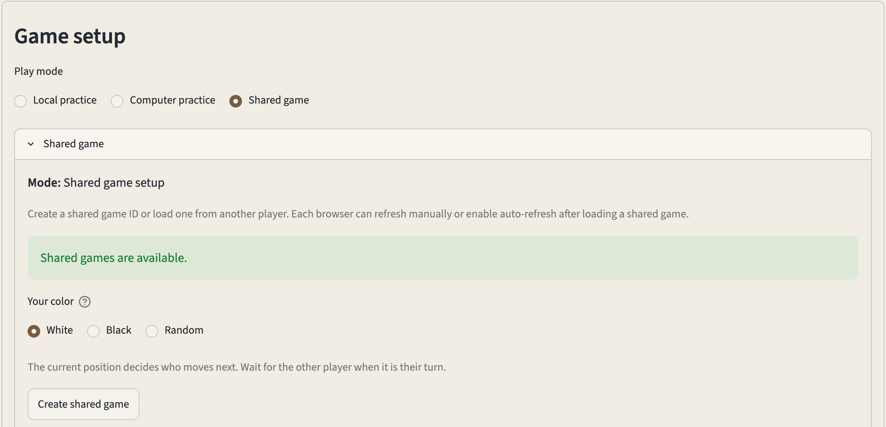
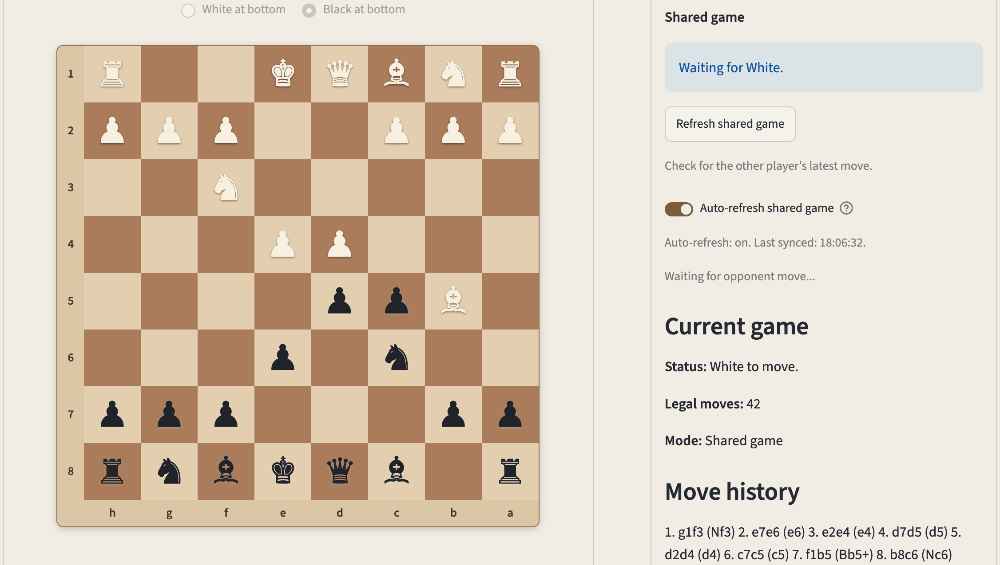
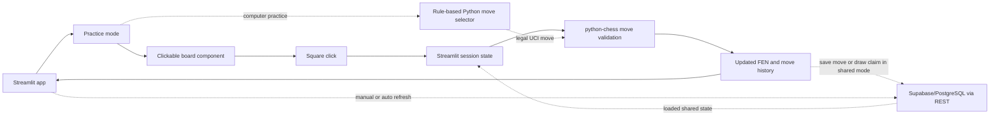

# Boardstep

Boardstep is a browser-based chess practice app built with Python and Streamlit.

It currently lets you practice legal chess moves on an interactive board, play local practice games against a custom rule-based computer opponent, load positions from FEN, and follow the current position in a simple web interface.

Chess rules, move validation, and computer move selection remain in Python. The clickable board uses a lightweight custom JavaScript component with separate HTML and CSS assets.

It also includes a shared game prototype. When creating a game, you can choose White, Black, or Random. Another browser session that loads the game ID is assigned the opposite color. Each session can play its assigned side or switch to Observer mode, then use auto-refresh for convenient syncing or refresh manually as a fallback.

Live demo: https://boardstep.streamlit.app





The deployed demo remains a prototype. Shared game features require configured shared-game storage and use manual refresh or polling-based auto-refresh rather than true real-time multiplayer.

## How it works



## Current features

Local practice:

* practice legal chess moves on an interactive board
* select a source square and target square directly on the main board
* see legal target squares after selecting a piece
* switch the local board orientation between White-at-bottom and Black-at-bottom
* use coordinate practice controls or typed UCI moves as fallback input
* view move history
* claim a draw when the same position has occurred three times
* end the game automatically when the same position has occurred five times
* copy the current position as FEN
* load a position from FEN

Computer practice:

* play a local game against a custom rule-based Python computer opponent
* choose whether to play White or Black
* use Boardstep's own Python move-selection logic at every level, without Stockfish or any other external chess engine
* use five practice levels:
  * Beginner: random legal moves
  * Easy: prefers immediate mates, captures, checks, and promotions
  * Basic: uses simple material scoring
  * Intermediate: uses opening priorities, looks one reply ahead, and applies lightweight positional scoring
  * Hard: uses bounded alpha-beta search with limited tactical extensions for captures, promotions, and check evasions
* preserve full move history so automatic fivefold draws are detected at every level
* let Intermediate and Hard account for claimable threefold outcomes during move evaluation
* claim an available threefold draw on the human player's turn
* see the selected practice level and last computer move in the game panel
* automatically reset the local computer-practice game when changing side or level
* use simple four-character promotion input that defaults to queen promotion when legal

Shared game prototype:

* create a shared game ID when shared storage is configured
* choose White, Black, or Random when creating a shared game
* assign the opposite color to another browser session that loads the game ID
* play only as the locally assigned color or switch to Observer mode
* see turn guidance and prevent moves that do not match the selected role
* align board orientation with the assigned playing color
* load a shared game by ID in another browser session
* see whether the app is in local practice mode or shared game mode
* find and reuse the active shared game ID
* save moves to shared storage after creating or loading a shared game
* preserve canonical UCI move history for repetition detection
* claim an available threefold draw when it is the assigned side's turn
* synchronize claimed draws between browser sessions
* end the shared game automatically after fivefold repetition
* manually refresh a shared game to load the latest saved position
* enable optional auto-refresh to check for the latest saved position
* see the latest local sync time
* pause auto-refresh while choosing a move
* leave shared game mode without deleting the saved shared game

## Shareable positions

Boardstep shows the current position as FEN, a compact text code for a chess position.

You can copy the FEN from one session and paste it into another session to restore the same board position. Loading a FEN clears the move history.

FEN describes the current position but does not contain its prior move history. A position loaded from FEN therefore starts a new repetition-history baseline.

## Shared game prototype

Boardstep includes a shared game flow backed by external storage, with auto-refresh for convenient syncing and manual refresh as a fallback.

One browser session creates a shared game ID and chooses White, Black, or Random. Another browser session that loads the same ID is assigned the opposite color. Board orientation, move permissions, and turn guidance follow the local assignment. Either session can switch to Observer mode to watch without making moves.

After a move is played, it is saved to storage. The other session can use `Refresh shared game` or enable optional auto-refresh to check for the latest saved position.

Threefold draw claims are also saved and become visible to the other session after manual or automatic refresh. Fivefold repetition ends the game automatically without a separate claim.

Leaving shared game mode returns the current browser session to local practice. It does not delete the saved shared game.

Color assignment is browser-session guidance rather than protected player ownership. Additional browser sessions that load the same ID can receive the same joining color.

This is not real-time multiplayer. Auto-refresh uses polling rather than live WebSocket synchronization. There are no accounts, private invites, clocks, ratings, chat, or chess-engine analysis. Anyone with the shared game ID can load that game.

See `docs/shared-game-flow.md` for the design note and `docs/shared-game-storage-setup.md` for storage setup notes.

## Current limitations

Boardstep is still a prototype, with a deliberately simple shared-game model.

* Board interaction uses click-to-move, not drag-and-drop.
* The clickable board may take a moment to appear on first load.
* Local practice is session-based unless a shared game is created or loaded.
* Shared games use manual refresh with optional polling-based auto-refresh, require configured storage, and are not real-time synchronized.
* Shared-game board orientation follows the locally selected role and is not stored as shared-game state.
* Color assignment and Observer mode are browser-session guidance rather than account-backed player ownership.
* Multiple browser sessions can load the same game ID and receive the same joining color.
* There are no accounts, private invites, clocks, ratings, chat, external chess-engine integration, Elo calibration, or AI coach.
* The computer opponent remains a lightweight rule-based practice helper, not an engine-strength opponent.

## Version history

* `v0.16.0` — history-aware repetition draws. Preserves the move history required for repetition detection, adds claimable threefold and automatic fivefold draws across local, computer, and shared games, synchronizes shared draw claims, detects automatic repetition endings at every computer level, and lets Intermediate and Hard account for claimable threefold draws during move evaluation.
* `v0.15.0` — Hard computer-practice level. Adds bounded alpha-beta search with limited tactical continuation analysis, exposes Hard in the practice UI, recovers pending computer turns more reliably, and refines endgame classification without relying on an external chess engine.
* `v0.14.0` — shared game side assignment and turn guidance. Lets creators choose White, Black, or Random, assigns the opposite color to joined browser sessions, adds Observer mode and side-based move restrictions, persists creator-side data with backward-compatible storage handling, and improves shared-mode and auto-refresh behavior.
* `v0.13.0` — automatic shared game refresh. Adds optional polling-based auto-refresh for shared games, shows the latest local sync time, pauses refresh while choosing a move, keeps manual refresh as a fallback, and updates shared-game wording while preserving the prototype shared-game model.
* `v0.12.0` — computer-practice mode. Adds local play against a simple rule-based Python computer opponent, practice levels from Beginner to Intermediate, side selection, visible level descriptions, queen-promotion handling for simple promotion input, and reset behavior when side or level changes.
* `v0.11.0` — frontend assets and layout polish. Separates the clickable board into a lightweight JavaScript component with HTML and CSS assets, adds a modest Streamlit theme, and groups the board and game panel more clearly.
* `v0.10.0` — board orientation toggle. Adds a local White-at-bottom / Black-at-bottom board orientation setting while keeping click-to-move, coordinate labels, legal-target highlighting, typed move input, and coordinate fallback controls aligned.
* `v0.9.0` — shared game UX polish. Makes shared games easier to create, load, refresh, leave, and understand while keeping manual refresh as the synchronization model.
* `v0.8.0` — clickable main board. Adds direct source-and-target square selection on the main chessboard while keeping coordinate controls as an optional practice/fallback section.
* `v0.7.0` — playable UI polish. Improves the playing layout with a clearer board and game panel, larger board display, tighter move controls, and refined board/piece styling.
* `v0.6.0` — manual-refresh shared game prototype. Adds shared game ID creation, loading by ID, move saving through configured external storage, manual refresh, and stale-state conflict messaging.
* `v0.5.0` — shared game foundation. Adds a shared turn-based game design note, a shared game state helper, and tests for the helper.
* `v0.4.0` — beginner move feedback. Adds legal target-square feedback after selecting a piece and keeps CI checks focused on the supported Python version.
* `v0.3.0` — shareable position flow using FEN. Adds FEN validation and position loading.
* `v0.2.0` — deployed browser demo. Adds the Streamlit Cloud demo link, Streamlit Cloud import support, and clearer FEN wording.
* `v0.1.0` — initial playable chess practice baseline. Includes legal move validation, styled board display, manual UCI input, move history, tests, CI, and README documentation.

## Possible next steps

* make the board and game layout responsive across mobile, tablet, and desktop screens, keeping the full board visible without horizontal scrolling
* add optional pawn promotion choice while keeping automatic queen promotion as the default
* add shareable game links and a clearer copy-and-join flow
* add optional player names and clearer joining guidance
* add a lightweight game summary panel
* explore protected player seats or authentication for a later shared-game version

## Run locally

```zsh
python -m venv .venv
source .venv/bin/activate
python -m pip install -r requirements.txt
python -m streamlit run app/streamlit_app.py
```

Shared-game storage is optional for local practice. To configure shared games, see `docs/shared-game-storage-setup.md`.

## Checks

```zsh
python -m compileall app boardstep tests
python -m pytest -q
git diff --check
```

## License

No open-source license is currently granted. All rights reserved.

You may view this repository on GitHub. Copying, redistribution, or reuse of the code requires prior permission.
