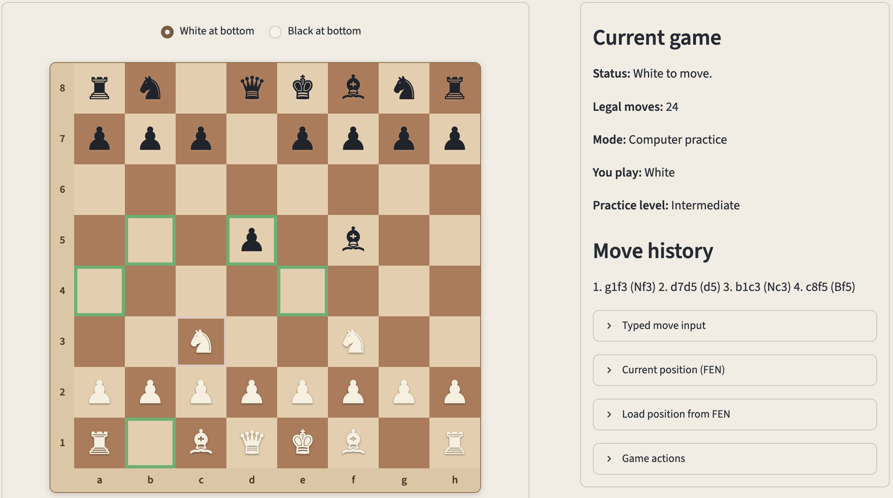
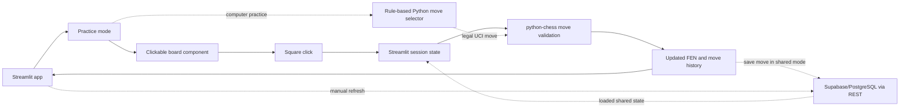

# Boardstep

Boardstep is a browser-based chess practice app built with Python and Streamlit.

It currently lets you practice legal chess moves on an interactive board, play local practice games against a simple rule-based computer opponent, load positions from FEN, and follow the current position in a simple web interface.

Chess rules, move validation, and computer move selection remain in Python. The clickable board uses a lightweight custom JavaScript component with separate HTML and CSS assets.

It also includes a manual-refresh shared game prototype. You can create a shared game ID, load it in another browser session, refresh manually to see the latest saved position, and leave shared mode without deleting the saved game.

Live demo: https://boardstep.streamlit.app



The deployed demo remains a prototype. Shared game features require configured shared-game storage and are not real-time multiplayer.

## How it works



## Current features

Local practice:

* practice legal chess moves on an interactive board
* select a source square and target square directly on the main board
* see legal target squares after selecting a piece
* switch the local board orientation between White-at-bottom and Black-at-bottom
* use coordinate practice controls or typed UCI moves as fallback input
* view move history
* copy the current position as FEN
* load a position from FEN

Computer practice:

* play a local game against a simple rule-based Python computer opponent
* choose whether to play White or Black
* use several practice levels:
  * Beginner: random legal moves
  * Easy: prefers immediate mates, captures, checks, and promotions
  * Basic: uses simple material scoring
  * Intermediate: uses opening priorities, looks one reply ahead, and applies lightweight positional scoring
* see the selected practice level and last computer move in the game panel
* automatically reset the local computer-practice game when changing side or level
* use simple four-character promotion input that defaults to queen promotion when legal

Manual-refresh shared game prototype:

* create a shared game ID when shared storage is configured
* load a shared game by ID in another browser session
* see whether the app is in local practice mode or shared game mode
* find and reuse the active shared game ID
* save moves to shared storage after creating or loading a shared game
* manually refresh a shared game to load the latest saved position
* leave shared game mode without deleting the saved shared game

## Shareable positions

Boardstep shows the current position as FEN, a compact text code for a chess position.

You can copy the FEN from one session and paste it into another session to restore the same board position. Loading a FEN clears the move history.

## Shared game prototype

Boardstep includes a manual-refresh shared game flow backed by external storage.

One browser session creates a shared game ID, and another session loads the same ID. After a move is played, it is saved to storage. The other session then uses `Refresh shared game` to load the latest saved position.

Leaving shared game mode returns the current browser session to local practice. It does not delete the saved shared game.

This is not real-time multiplayer. There are no accounts, private invites, clocks, ratings, chat, or chess engine. Anyone with the shared game ID can load that game.

See `docs/shared-game-flow.md` for the design note and `docs/shared-game-storage-setup.md` for storage setup notes.

## Current limitations

Boardstep is still a prototype, with a deliberately simple shared-game model.

* Board interaction uses click-to-move, not drag-and-drop.
* The clickable board may take a moment to appear on first load.
* Local practice is session-based unless a shared game is created or loaded.
* Shared games use manual refresh, require configured storage, and are not real-time synchronized.
* Board orientation is local to the current browser/session and is not saved to shared-game state.
* Shared games do not assign White/Black players or restrict moves by player side yet.
* There are no accounts, private invites, clocks, ratings, chat, external chess engine, Elo calibration, or AI coach.
* The computer opponent is a simple rule-based practice helper, not an engine-strength opponent.

## Version history

* `v0.12.0` — computer-practice mode. Adds local play against a simple rule-based Python computer opponent, practice levels from Beginner to Intermediate, side selection, visible level descriptions, queen-promotion handling for simple promotion input, and reset behavior when side or level changes.
* `v0.11.0` — frontend assets and layout polish. Separates the clickable board into a lightweight JavaScript component with HTML and CSS assets, adds a modest Streamlit theme, and groups the board and game panel more clearly.
* `v0.10.0` — board orientation toggle. Adds a local White-at-bottom / Black-at-bottom board orientation setting while keeping click-to-move, coordinate labels, legal-target highlighting, typed move input, and coordinate fallback controls aligned.
* `v0.9.0` — shared game UX polish. Makes shared games easier to create, load, refresh, leave, and understand while keeping manual refresh as the synchronization model.
* `v0.8.0` — clickable main board. Adds direct source-and-target square selection on the main chessboard while keeping coordinate controls as an optional practice/fallback section.
* `v0.7.0` — playable UI polish. Improves the playing layout with a clearer board and game panel, larger board display, tighter move controls, and refined board/piece styling.
* `v0.6.0` — manual-refresh shared game prototype. Adds shared game ID creation, loading by ID, move saving through configured external storage, manual refresh, and stale-state conflict messaging.
* `v0.5.0` — shared game foundation. Adds a shared turn-based game design note, a shared game state helper, and tests for the helper.
* `v0.4.0` — beginner move feedback. Adds legal target-square feedback after selecting a piece and keeps CI checks focused on the supported Python version.
* `v0.3.0` — shareable position flow using FEN. Adds FEN validation and position loading.
* `v0.2.0` — deployed browser demo. Adds the Streamlit Cloud demo link, Streamlit Cloud import support, and clearer FEN wording.
* `v0.1.0` — initial playable chess practice baseline. Includes legal move validation, styled board display, manual UCI input, move history, tests, CI, and README documentation.

## Possible next steps

* define player side selection for shared games
* add side-based move rules for shared game mode
* add a lightweight game summary panel
* improve clickable-board loading and responsive layout

## Run locally

```zsh
python -m venv .venv
source .venv/bin/activate
python -m pip install -r requirements.txt
python -m streamlit run app/streamlit_app.py
```

Shared-game storage is optional for local practice. To configure shared games, see `docs/shared-game-storage-setup.md`.

## Checks

```zsh
python -m compileall app boardstep tests
python -m pytest -q
git diff --check
```

## License

No open-source license is currently granted. All rights reserved.

You may view this repository on GitHub. Copying, redistribution, or reuse of the code requires prior permission.
