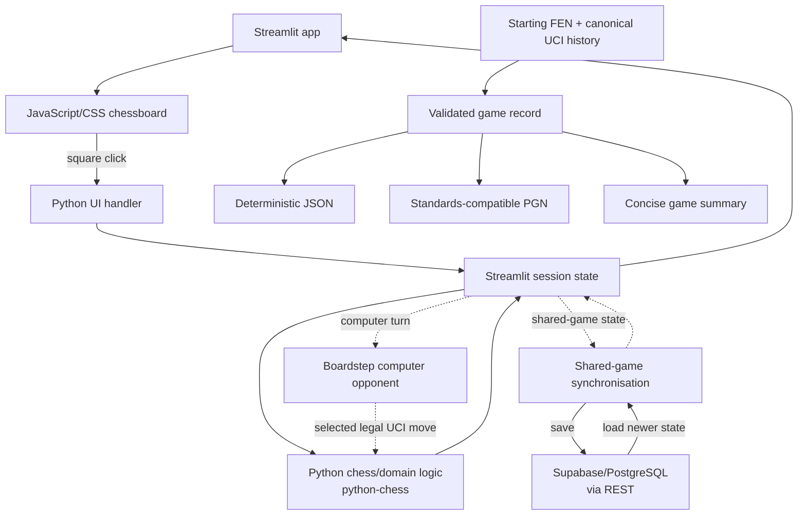

# Boardstep

Boardstep is a chess practice app for local play, computer practice, and shared games. Chess rules, move validation, computer move selection, repetition handling, and validated game-record processing are implemented in Python.

Shared games use optional external storage with manual refresh or polling-based auto-refresh rather than true real-time synchronisation. Validated game records are storage-independent and support deterministic JSON serialisation, standards-compatible PGN serialisation, and concise summaries.

**Live demo:** [boardstep.streamlit.app](https://boardstep.streamlit.app)

**Core:** Python · `python-chess`

**Web app:** Streamlit · lightweight JavaScript/CSS chessboard

**Testing and CI:** pytest · GitHub Actions

## Key capabilities

* **Local practice** — play legal moves on the interactive board, inspect legal targets and move history, switch board orientation, work with FEN positions, and handle repetition draws.
* **Computer practice** — play as White or Black against Boardstep's custom Python computer opponent, using its own move-selection logic across five practice levels, from random legal moves to bounded alpha-beta search.
* **Shared games** — create or join games through a shared game ID, use side assignment or Observer mode, and synchronise saved state through manual refresh or optional polling-based auto-refresh.
* **Validated game records** — validate canonical game history independently of storage, derive SAN and result metadata, produce deterministic JSON and standards-compatible PGN, and generate concise summaries.


## Practice modes

### Local practice

Local practice uses the interactive board without requiring shared-game storage.

* select source and target squares directly on the main board;
* see legal target squares after selecting a piece;
* highlight the origin and destination squares of the latest completed move;
* scale the board to the available browser width while preserving square proportions;
* switch between White-at-bottom and Black-at-bottom orientation;
* use coordinate controls or typed UCI moves as fallback input;
* view move history;
* claim a draw after threefold repetition; fivefold repetition ends the game automatically;
* copy the current position as FEN or load a position from FEN.

FEN represents the current chess position but not its preceding move history. Loading a FEN therefore clears the current move history and establishes a new repetition-history baseline.

### Computer practice

Computer practice uses Boardstep's own Python move-selection logic rather than Stockfish or another external chess engine. You can play as White or Black at five practice levels:

* **Beginner** — selects random legal moves.
* **Easy** — prefers immediate mates, captures, checks, and promotions.
* **Basic** — uses simple material scoring.
* **Intermediate** — uses opening priorities, looks one reply ahead, and applies lightweight positional scoring.
* **Hard** — uses bounded alpha-beta search with limited tactical extensions for captures, promotions, and check evasions.

Full move history is preserved so automatic fivefold draws are detected at every level. Intermediate and Hard also account for claimable threefold outcomes during move evaluation, while the human player can claim an available threefold draw on their turn.

The game panel shows the selected practice level and latest computer move. The board remains visible with `Computer thinking…` while a reply is calculated, and move input is disabled until that reply is ready. Changing side or practice level starts a new computer-practice game.

Simple four-character promotion input defaults to queen promotion when legal.

## Shared games

Shared-game features require configured external storage. One browser session creates a shared game ID and chooses White, Black, or Random. Another browser session that loads the same ID is assigned the opposite colour. Each session can play only as its locally assigned colour or switch to Observer mode.

Board orientation, move permissions, and turn guidance follow the local assignment. The interface distinguishes `Your turn`, waiting, and read-only Observer states and disables move controls when the current browser cannot move.

After a move is played, the updated game state is saved to shared storage. Another session can use `Refresh shared game` or enable optional auto-refresh to poll for newer saved state. Polling that finds no update preserves the current local move selection, and refreshed state is applied only when a move or game-result update is detected.

Canonical UCI move history is stored with the shared game so repetition behaviour remains history-aware. An available threefold draw can be claimed by the assigned side whose turn it is; the claim is saved and becomes visible to other sessions after refresh. Fivefold repetition ends the game automatically.

Leaving shared-game mode returns the current browser session to local practice without deleting the saved shared game.

Colour assignment and Observer mode are browser-session guidance rather than protected player ownership. Additional browser sessions that load the same game ID can receive the same joining colour, and anyone with the game ID can load the game.

Shared games are not true real-time multiplayer. Synchronisation uses manual refresh or polling rather than a live WebSocket connection. There are no accounts, protected player ownership, private invitations, clocks, ratings, chat, or chess-engine analysis.

See [`docs/shared-game-flow.md`](docs/shared-game-flow.md) for the design note and [`docs/shared-game-storage-setup.md`](docs/shared-game-storage-setup.md) for storage setup.

## Validated game records

Boardstep provides immutable, storage-independent game records built from a starting FEN and canonical UCI move history.

The game-record layer can:

* replay and validate every recorded move;
* derive SAN move history, final FEN, game result, termination reason, and an optional claimed-draw reason;
* serialise records deterministically as structured JSON data or formatted JSON text;
* serialise records as standards-compatible PGN with result metadata;
* include `FEN` and `SetUp` PGN headers for non-standard starting positions;
* preserve custom side-to-move and fullmove-number metadata in PGN output;
* derive concise summaries containing the outcome, individual move count, latest SAN move, starting-position type, and termination-specific text.

These capabilities are tested domain-layer APIs. The Streamlit app does not currently expose JSON or PGN download controls or a game-summary panel.

## Architecture



Python owns chess rules, move validation, computer logic, repetition handling, and game-record processing, with `python-chess` providing the rules and notation foundation. Streamlit coordinates the application and browser-session state, while the JavaScript/CSS chessboard handles direct board interaction and presentation.

Optional external storage is confined to shared-game persistence and synchronisation. The validated game-record layer is independent of both Streamlit and shared-game storage.

`boardstep/game_record.py` validates canonical UCI histories and derives SAN history, final FEN, results, and termination metadata. `boardstep/game_record_json.py`, `boardstep/game_record_pgn.py`, and `boardstep/game_record_summary.py` provide deterministic JSON serialisation, standards-compatible PGN serialisation, and concise immutable summaries.

## Current limitations

Boardstep is a chess practice app with deliberately bounded computer and shared-game functionality.

* Board interaction uses click-to-move rather than drag-and-drop.
* Local and computer practice are session-based and do not provide persistent personal game history.
* Shared games require configured external storage and do not provide account-backed player ownership.
* The computer opponent is a bounded practice opponent rather than an engine-strength service; there is no external chess-engine integration or Elo calibration.
* Validated game records, JSON/PGN serialisation, and concise summaries are available through domain-layer APIs but are not yet exposed as Streamlit review or download controls.

## Local setup

Create and activate a virtual environment, install the project dependencies, and start the Streamlit application:

```zsh
python -m venv .venv
source .venv/bin/activate
python -m pip install -r requirements.txt
python -m streamlit run app/streamlit_app.py
```

Shared-game storage is optional for local and computer practice. To configure shared games, see [`docs/shared-game-storage-setup.md`](docs/shared-game-storage-setup.md).

## Verification

Run the repository checks:

```zsh
python -m compileall app boardstep tests
python -m pytest -q
git diff --check
```

GitHub Actions runs the Python compilation and pytest checks on Python 3.12 for pull requests and pushes to `main`.

## Releases

Versioned release notes are available in [GitHub Releases](https://github.com/NikolayAir/Boardstep/releases).

## Security

Report suspected vulnerabilities privately through GitHub Private Vulnerability Reporting; see [SECURITY.md](SECURITY.md).

## Licence

Copyright © 2026 Nikolay Popov. All rights reserved.

No open-source licence is granted for project-authored material.

This public repository may be viewed and forked through GitHub as permitted by GitHub's Terms of Service. Any additional copying, redistribution, modification, or reuse of project-authored material requires prior permission, except as otherwise permitted by applicable law.

Third-party dependencies remain subject to their respective licences.
