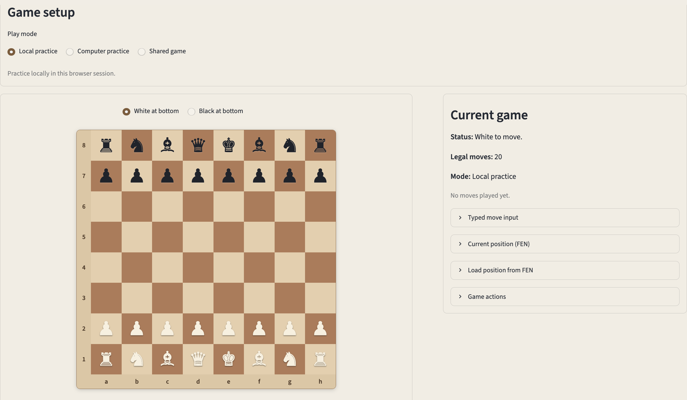
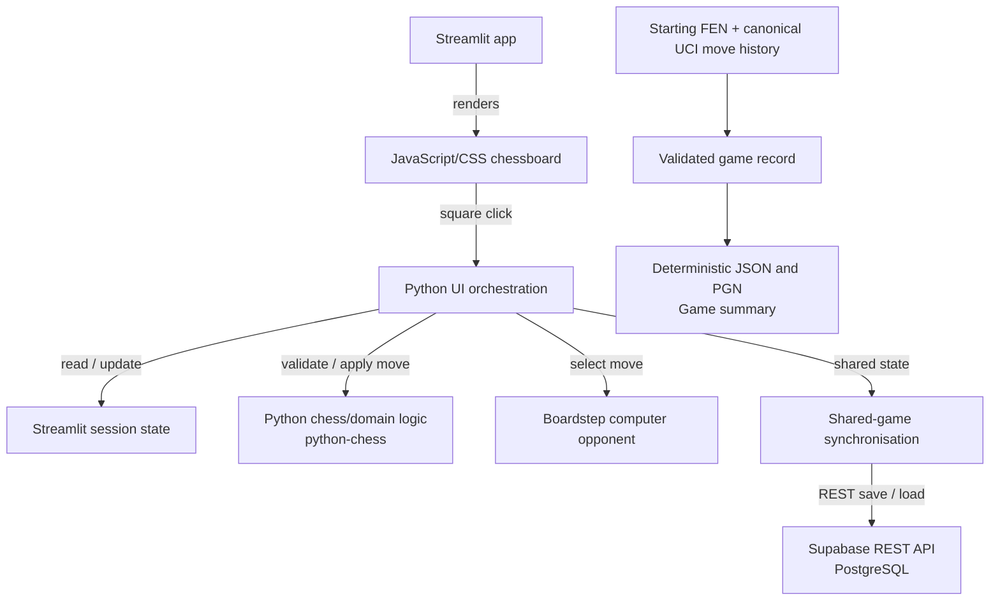

# Boardstep

Boardstep is a chess practice app with local, computer, and shared modes, built around tested Python chess logic and a custom computer opponent.

**Core:** Python · `python-chess`

**Web app:** Streamlit · JavaScript/CSS chessboard · [Live demo](https://boardstep.streamlit.app)

**Testing and CI:** pytest · pytest-cov · Ruff · GitHub Actions



## Key capabilities

* **Local practice** — make legal moves on the interactive board, inspect legal targets and move history, switch board orientation, load or copy positions in Forsyth-Edwards Notation (FEN), and handle repetition draws.
* **Computer practice** — play as White or Black against Boardstep's Python computer opponent, using its own move-selection logic across five practice levels, from random legal moves to bounded alpha-beta search.
* **Shared games** — create a shared game or join one using its ID, use side assignment or Observer mode, and synchronise saved state through manual refresh or optional polling-based auto-refresh.
* **Validated game records** — validate canonical move history independently of storage; derive move history in Standard Algebraic Notation (SAN) together with result and termination information; produce deterministic JSON and Portable Game Notation (PGN) serialisations; and generate concise summaries.

## Architecture



Python owns chess rules, move validation, repetition handling, computer-opponent logic, shared-game state validation and replay, and game-record processing, with `python-chess` providing the rules and notation foundation. Streamlit coordinates UI orchestration and renders from browser-session state, while the JavaScript/CSS chessboard handles direct board interaction and presentation.

Optional external storage is confined to shared-game persistence and synchronisation. The validated game-record layer is independent of both Streamlit and shared-game storage.

## Practice modes

### Local practice

Local practice uses the interactive board without requiring external storage.

* select source and target squares directly on the board and inspect legal targets;
* view move history and highlight the latest completed move;
* scale the board to the available browser width and switch its orientation;
* use coordinate controls or typed Universal Chess Interface (UCI) move strings as fallback input;
* claim threefold draws while fivefold repetition ends the game automatically;
* copy the current position as FEN or load a position from FEN.

FEN represents the current chess position but not its preceding move history. Loading a FEN therefore clears the current move history and establishes a new repetition-history baseline.

### Computer practice

Computer practice uses Boardstep's own Python move-selection logic and does not rely on Stockfish or another external chess engine. You can choose White or Black and one of five practice levels:

* **Beginner** — selects random legal moves.
* **Easy** — prioritises immediate mates, captures, checks, and promotions.
* **Basic** — scores resulting positions using material balance.
* **Intermediate** — combines opening priorities, one-reply lookahead, and lightweight positional evaluation.
* **Hard** — uses bounded alpha-beta search with tactical quiescence extensions for captures, promotions, and check evasions.

Full move history is preserved so automatic fivefold draws are detected at every level. Intermediate and Hard also account for claimable threefold outcomes during move evaluation, while the human player can claim an available threefold draw on their turn.

The game panel shows the selected practice level and latest computer move. The board remains visible with `Computer thinking…` while a reply is calculated, and move input is disabled until that reply is ready. Changing side or practice level starts a new game. Four-character promotion input defaults to queen promotion when legal.

## Shared games

Configured external storage is required. One browser session creates a shared game ID and chooses White, Black, or Random. A second session loading the same ID is assigned the opposite colour. Each session can make moves only for its assigned colour or switch to Observer mode. Board orientation, move permissions, and turn guidance follow the session's current role. Leaving shared mode returns the session to local practice without deleting persisted state.

Moves are saved to shared storage and other sessions can use `Refresh shared game` or optional auto-refresh to check for updates. A normal refresh that finds no change preserves the current local move selection. If a locally applied move cannot be saved, further shared moves and draw claims are blocked until authoritative persisted state is restored through refresh.

Canonical UCI move history is stored as part of the shared state so repetition behaviour remains history-aware. The assigned side to move can claim an available threefold draw, and the saved claim becomes visible to other sessions after refresh; fivefold repetition ends the game automatically.

Colour assignment and Observer mode are browser-session controls, not protected player ownership. Additional sessions that load the same ID can be assigned the same colour, and anyone with that ID can load the game. Synchronisation uses manual refresh or polling and does not use a live WebSocket connection. Boardstep does not provide accounts, private invitations, clocks, ratings, chat, or chess-engine analysis.

See [`docs/shared-game-flow.md`](docs/shared-game-flow.md) for the design note and [`docs/shared-game-storage-setup.md`](docs/shared-game-storage-setup.md) for storage setup.

## Validated game records

Boardstep builds immutable game records from a starting FEN and canonical UCI move history. These records are independent of shared-game storage.

The game-record layer can:

* replay and validate every recorded move;
* derive SAN move history, final FEN, result, termination reason, and an optional claimed-draw reason;
* serialise records deterministically as JSON or PGN, including result information;
* include `FEN` and `SetUp` PGN headers for non-standard starting positions;
* preserve side-to-move and fullmove numbering from custom starting FENs in PGN output;
* derive concise summaries containing the outcome, individual move count, latest SAN move, starting-position type, and termination-specific text.

These capabilities are tested domain-layer APIs.

## Scope

Boardstep uses click-to-move and does not provide drag-and-drop. Local and computer practice are session-based and do not provide persistent personal game history. Shared mode requires configured external storage and does not provide account-backed player ownership.

The computer opponent does not use an external chess engine or provide Elo-calibrated strength. Game-record review, summaries, and JSON/PGN exports are not currently exposed in Streamlit.

## Local setup

To run Boardstep locally with Python 3.12, set up a virtual environment and install the dependencies:

```zsh
python -m venv .venv
source .venv/bin/activate
python -m pip install -r requirements.txt
```

Start the application from the repository root:

```zsh
python -m streamlit run app/streamlit_app.py
```

External storage is required only for shared games; see [`docs/shared-game-storage-setup.md`](docs/shared-game-storage-setup.md) for setup.

## Verification

Install the development dependencies:

```zsh
python -m pip install -r requirements-dev.txt
```

Run the local checks:

```zsh
python -m pip check
python -m ruff check app boardstep tests
python -m compileall app boardstep tests
python -m pytest -q --cov=boardstep --cov=app --cov-branch --cov-report=term-missing
git diff --check
```

GitHub Actions runs dependency checks, Ruff linting, Python compilation, and pytest with non-gating branch coverage reporting on Python 3.12 for pull requests, pushes to `main`, and manual runs.
## Releases

Versioned release notes are available in [GitHub Releases](https://github.com/NikolayAir/Boardstep/releases).

## Security

Report suspected vulnerabilities through GitHub Private Vulnerability Reporting. See [SECURITY.md](SECURITY.md) for details.

## Licence

Copyright © 2026 Nikolay Popov. All rights reserved.

No open-source licence is granted for project-authored material.

This public repository may be viewed and forked through GitHub as permitted by GitHub's Terms of Service. Any additional copying, redistribution, modification, or reuse of project-authored material requires prior permission, except as otherwise permitted by applicable law.

Third-party dependencies remain subject to their respective licences.
